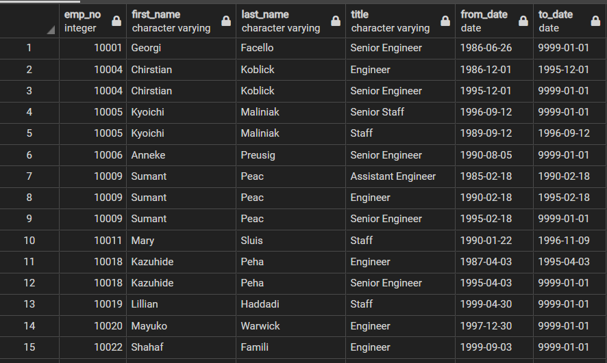
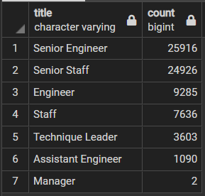
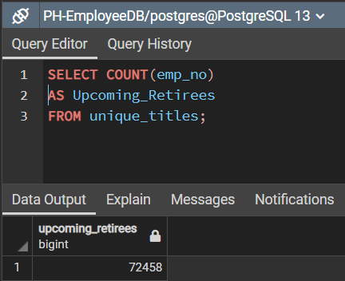

# Pewlett-Hackard-Analysis

## Overview Of the Analysis:

### The purpose of the Challenge analysis portion of this module is to provide answers to the questions below,

* Determine The Number of Retiring Employees by Title.
* Create a Mentorship Eligibility table that holds eligible employees to participate in a mentorship program.

## Results:

###  In order to find out the number of retiring employees by title, we followed few steps:

* We first created a table, called "Retirement Titles", in which we included all of the employees with with a birth date between 01-01-1952 and 12-31-1955.

* Upon creating this table, we realized that there are duplicate entries for some employees because they have switched titles over the years. The following image displays the second table created in which we removed these duplicates and only kept the most recent title of each employee. To create the Unique_titles table, we used the DISTINCT ON statement, it helped us keep only the most recent title per employee.

* We then wrote another query to retrieve the number of employees by their most recent title who are getting closer to retirement. We did so by getting the number of titles from the Unique Titles table previously created, the information collected was put in a new table, called Retiring_titles. We grouped this table by title column, then sorted it in a descending order.

### Next we moved to identifying a list of eligible employees for the Mentorship Program. To do so,

* We created a new table by joining both the Employees and the Department Employees tables as well as the Employees and the Titles tables. We also used the DISINCT BY statement to get the first occurrence of the employee number for each set of rows, we filtered the data to only get the employees born between 01-01-1965 and 12-31-1965, then ordered the new table by the employee number. The query used is showcased below,

* The employees listed in the mentorship_eligibility table are all eligible for the Mentorship Program, during which they will be provding mentorship and training to other team members prior to retiring.
* The number of employees eligible for the Mentorship Program is 1,549.

## Summary:

* Out of the 300,024 total employees in the company, 72,548 are eligible for retirement, that is 24.18% of the total workforce provided in the database. We got this figure by using the below query

* All of these roles will need to be filled, which means the company will need to hire/train 72,548 new team members.
* As we gathered previously, there is only 1,549 employees who are eligible for the Mentorship Program, which means that each mentor will be overseeing approximately 46 to 47 employees, a very hard task to achieve, especially if we consider the other tasks that still need to be completed by each mentor as part of their current job.
* The company will need to provide alternative solutions on how to train and mentor future talent, one of the solutions would be expanding the range for the Mentorship Program, this will provide a boost in the number of mentors, who may have less experience but still qualified enough to fullfill the task. The below query and New_Mentors column show that the new count for the eligible mentors increased drastically to 93,756, which means they could have almost a 1:1 ratio per mentor/trainee. The birth dates chosen for this query were extended to all employees born between 1960 and 1967.

* Another suggestion to the company is to accelerate their recruiting and hiring process immediately, prior to the "SIlver Tsunami" event. So in parallel to the mentorship program, the Human Resources department should be fully committed to recruiting new team members who will in return take advantage of the mentorship program for a longer period of time.
